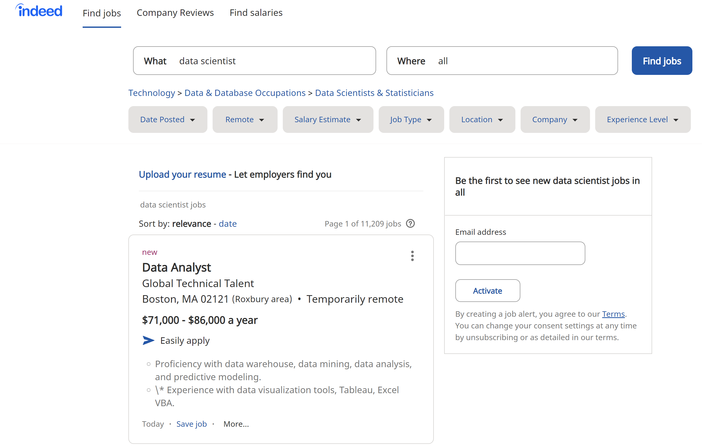

```{r setup, include=FALSE}
knitr::opts_chunk$set(echo = FALSE, warning = FALSE, message = FALSE)
pacman::p_load(
  rvest,
  tidyverse,
  data.table,
  DT,
  magrittr,
  digest,
  RPostgreSQL,
  tidytext,
  config,
  tm,
  SnowballC,
  wordcloud,
  wordcloud2,
  ggpubr,
  RColorBrewer,
  RCurl,
  XML,
  stringr,
  zoo,
  knitr,
  extrafont
)
```
#  Introduction
<p style="text-indent:32px;">We may face obstacles finding jobs. I guess most of us want to find jobs associated with data analysis. For me, I may find a job as a data analyst or a data scientist. However, for now I have no idea about how to find it. Then I searched on Indeed, trying to find something that will be helpful. I mainly focused on the information in job description, trying to give some analysis.</p>

# About the data set
<p style="text-indent:32px;">Indeed has a straight-forward structure, which is very easy to search a job. Here is the link and preview of the wibset:</p>
<p style="text-indent:32px;"><https://www.indeed.com/jobs?q=data+scientist&l=all&start=></p>
```{r pressure, echo=FALSE, out.width = '100%'}

```

<br>
<p style="text-indent:32px;"> We can just do a simple scrape with *rvest* library in R. For the convience, I stored data into a csv file for further step.</p>

<p style="text-indent:32px;"> The next step is data cleaning. I removed stopwords, punctuation, and numbers, and converted it to lowercase.</p>
```{r}
df <- read.csv("df.csv")
df$description %<>% tolower()
df$description %<>% removeWords(stopwords("english"))
df$description %<>% removePunctuation()
df$description %<>% removeNumbers()
```
# Exploratory Data Analysis

## Working experience

<p style="text-indent:32px;"> Here is a quesiton:</p>

>***How many years of working experience do those companies ask for?***

The graph shows that the distribution of years that companies require for data scientist. From the graph, ee can see that most of data scientist positions need people with 3-6 years of experience. The distribution is skewed left distributions.
```{r}
Working_Experience <- function(text){
  # Extract numbers
  extractnumber <- function(string){
    str_extract(string, "\\-*\\d+\\.*\\d*")}
  # Extract numbers
  years = extractnumber(text)
  # Remove NAs
  years <- as.numeric(years[!is.na(years)]) 
  # set an limitation of years
  years <- years[(years < 15) & (years %% 1 == 0) & (years >= 0)] 
  # Make plot
p <- gghistogram(data.frame(years), 
                   x = "years",
                   fill = "pink", 
                   color = "lightblue",
                   alpha=0.5, 
                   binwidth = 1
                   )
ggpar(p, xlab = "Years", ylab = "Frequency",
        title = "Working Experience Required",
        xticks.by = 1,
        ggtheme = theme_pubr())+ font("title", hjust=0.5)
}
Working_Experience(unlist(df))
```
<br>

## Most frequent words
<p style="text-indent:32px;">Now, let's see the top 10 most frequent words from November Data Set:</p>
```{r}
# Word count
word_count <- df %>% 
  unnest_tokens(output = "word", token = "words", input = description) %>%
  anti_join(stop_words) %>%
  count(word, sort = TRUE)
kable(head(word_count, 10))
```
<hr>
```{r}
ggplot(data = head(word_count, n = 10), aes(x = word, y = n)) + 
  geom_bar(stat = "identity", fill = "pink", col = "lightblue") +
  theme(axis.text.x = element_text(angle = 60, hjust = 0.5, vjust = 0.5))
```

<br>

<p style="text-indent:32px;"> The word "data" is the most frequent with no doubt. "experience" follows by, which indicates that working experience is important in this position. Another observation is *"machine learning"*. We can conclude that for data scientists, machine learning is also a core skill.</p>

<br>

## Companies and Locations

<p style="text-indent:32px;">Let's look at Companies and locations.</p>
```{r}
# Company count
company_count <- df %>%
  unnest_tokens(output = "word", token = "words", input = description) %>%
  anti_join(stop_words) %>%
  count(company, sort = TRUE)
kable(head(company_count, 10))
```
<hr>
```{r}
ggplot(data = head(company_count, n = 10), aes(x = company, y = n)) + 
  geom_bar(stat = "identity", fill = "pink", col = "lightblue") +
  theme(axis.text.x = element_text(angle = 60, hjust = 0.5, vjust = 0.5))
```

<br>
```{r}
# Location count
location_count <- df %>%
  unnest_tokens(output = "word", token = "words", input = description) %>%
  anti_join(stop_words) %>%
  count(location, sort = TRUE)
kable(head(location_count, 10))
```
<hr>
<br>
```{r}
ggplot(data = head(location_count, n = 10), aes(x = location, y = n)) + 
  geom_bar(stat = "identity", fill = "pink", col = "lightblue") +
  theme(axis.text.x = element_text(angle = 60, hjust = 0.5, vjust = 0.5))
```
<br>

<p style="text-indent:32px;"> It can be seen that data scientists are not required by technique companies such as *Facebook* or *Microsoft*, which is different from what I thought before; As for locations, Boston is a good place for finding a data scientist job. Also, New York is another good option.</p>

<br>

# Words Cloud
<p style="text-indent:32px;"> This is the funny part that I want to try. All the words can be visualized by using *wordcloud2* package in R.
```{r}
WordPlot <- function(text){
  # Create content transformer
  ct <- content_transformer(function(x, pattern) {return (gsub(pattern," ", x))})
  # Perform necessary operations to corpus
  operations <- Corpus(VectorSource(text))
  operations <- tm_map(operations, ct, "/")
  operations <- tm_map(operations, ct, "-")
  operations <- tm_map(operations, content_transformer(tolower)) 
  operations <- tm_map(operations, removePunctuation)
  operations <- tm_map(operations, stripWhitespace) 
  operations <- tm_map(operations, removeWords, stopwords("english")) 
  operations <- tm_map(operations, removeNumbers)
  operations <- tm_map(operations, stemDocument, "english") 
  # Create a temportary matrix
  temp <- DocumentTermMatrix(operations) 
  # Removes terms with sparsity >=  99%
  temp <- removeSparseTerms(temp, 0.99)
}

# Load the job descriptions
des <- df$description

des1 <- WordPlot(des)
# Combine into collective matrix
temp <- c(des1)
set.seed(300)
PlotMaking <- function(temp){
  a1 <- as.matrix(t(temp))
  a2 <- sort(rowSums(a1),decreasing = TRUE)
  a3 <- data.frame(word = names(a2),freq = a2)
  # Wordcloud of 200 most frequently used words
  library(wordcloud2)
  set.seed(731)
  wordcloud2(a3)}

PlotMaking(des1)
```
<br>

<p style="text-indent:32px;">The same conclusion we can get from this word cloud, i.e. **experience** is the most frequent term except **data**. Notice that some of the terms represent stemmed versions of proper English words (i.e. *experi* instead of *experience*).</p>

# Summary and Conclusion

>***What can we get from the visualization?***

* A data scientist positon usually needs people who have 3-6 year experience;

* Not only technique companies need data scientists, so don't find job only in this field;

* Boston and New York may have more chance.

* As a scientist, modeling and machine learning are important.

* Personally speaking, after graduation I would recommend us starting as data analyst.

